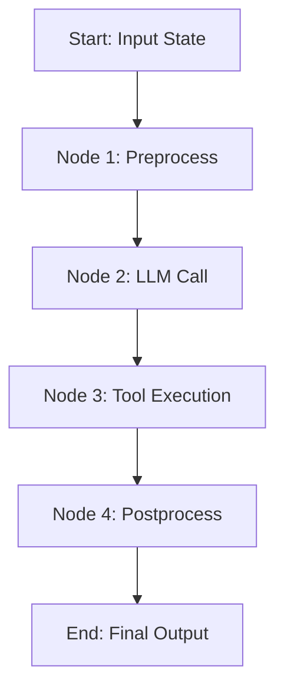
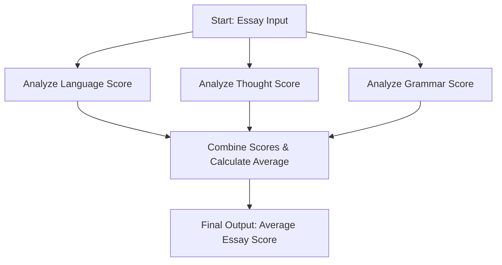
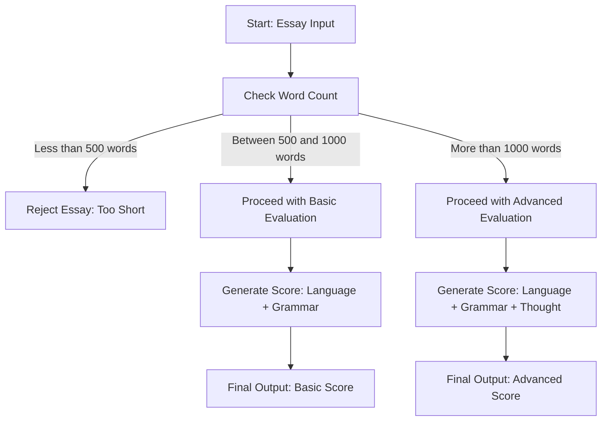
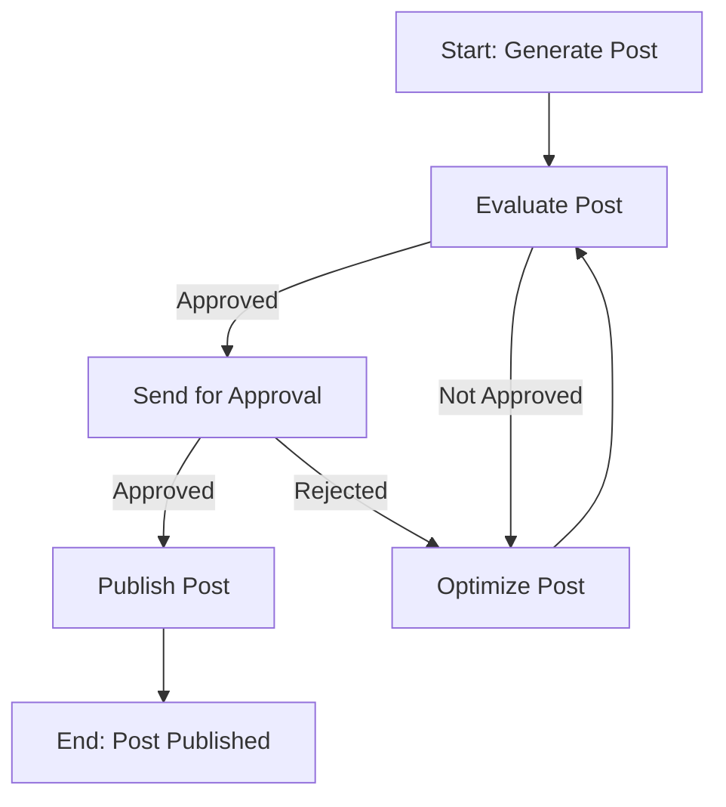

# LangGraph Workflows

It covers the fundamental components—State, Nodes, Edges—and demonstrates how to assemble and run a graph.

---

## The Core Components: A Practical Guide

Building a LangGraph workflow involves defining its structure and components before compiling it into a runnable application.

### 1. Defining the State

The **State** is the central object that carries information through your graph. Every node will have access to it.

- **What's Required**: The state must be a data structure, typically a Python `TypedDict`. Each key in the dictionary represents a piece of information that your application will track.
- **How to Create**: You define a class that inherits from `TypedDict`. To make the state updatable, you can use `typing.Annotated` to specify a reducer function. The most common reducer is `operator.add`, which appends new values to existing lists in the state.

```python
from typing import TypedDict, Annotated
import operator

# This defines the structure of our state.
# 'messages' will be a list of messages, and new messages will be appended.
class GraphState(TypedDict):
    messages: Annotated[list, operator.add]
```

### 2. Creating the Nodes

A **Node** is a function that performs a unit of work. It's the primary building block of your graph's logic.

- **What's Required**: A node must be a Python function that accepts a single argument: the current `state` object (which will be an instance of your `GraphState` class). The function must return a dictionary where the keys match the keys in the `GraphState` you wish to update.
- **How to Create**: Define a function that implements your desired logic (e.g., calling an LLM). It should read any necessary information from the input `state` and return a dictionary with the new information to be added to the state.

```python
def my_node_function(state: GraphState):
    # Node logic goes here...
    # For example, call an LLM using the messages from the state.
    # response = model.invoke(state['messages'])

    # The return value must be a dictionary with keys matching the state.
    # This will be passed to the reducer to update the main state.
    return {"messages": [response]}
```

### 3. Defining the Graph and Adding Components

Once you have your state and node functions, you can assemble them into a graph.

- **What's Required**: An instance of `langgraph.graph.StateGraph`. You must pass your state definition (`GraphState`) to its constructor.
- **How to Create**:
  1.  Instantiate `StateGraph`.
  2.  Use the `.add_node()` method to add each of your functions as a node, giving each node a unique string name.
  3.  Use `.set_entry_point()` to tell the graph where to begin execution.
  4.  Use `.add_edge()` to connect the nodes. You can connect a node to another node, or to the special `END` constant to terminate the workflow.

```python
from langgraph.graph import StateGraph, END

# Initialize the graph, passing it the state definition
workflow = StateGraph(GraphState)

# Add nodes to the graph
workflow.add_node("node_1", my_node_function_1)
workflow.add_node("node_2", my_node_function_2)

# Set the entry point
workflow.set_entry_point("node_1")

# Add edges to define the flow
workflow.add_edge("node_1", "node_2")
workflow.add_edge("node_2", END)
```

### 4. Compiling the Graph

The final step is to compile your defined structure into an executable object.

- **What's Required**: A fully defined `StateGraph` object with at least one node, an entry point, and edges that lead to an `END`.
- **How to Create**: Simply call the `.compile()` method on your `workflow` object. This returns a LangChain `Runnable` that you can invoke.

```python
app = workflow.compile()
```

---

# Sequential Workflow



## Example: A Sequential Prompt Chaining Workflow

Let's build a simple 2-step workflow that first generates a topic and then writes a poem about it.

### Step 1: Define the State

Our state needs to hold the user's initial category, the generated topic, and the final poem.

```python
from typing import TypedDict

class ChainingState(TypedDict):
    category: str
    topic: str
    poem: str
```

### Step 2: Define the Nodes

We need two nodes: one to generate the topic and one to write the poem.

```python
from langchain_openai import ChatOpenAI

# Initialize a model to be used by the nodes
model = ChatOpenAI(temperature=0)

def generate_topic_node(state: ChainingState):
    """Generates a specific topic based on a general category."""
    prompt = f"Generate a specific, interesting topic related to the category: {state['category']}"
    response = model.invoke(prompt)
    print("---TOPIC GENERATED---")
    return {"topic": response.content}

def write_poem_node(state: ChainingState):
    """Writes a short poem about the generated topic."""
    prompt = f"Write a short, four-line poem about: {state['topic']}"
    response = model.invoke(prompt)
    print("---POEM WRITTEN---")
    return {"poem": response.content}
```

### Step 3: Build the Graph

Now we assemble the state and nodes into a graph structure.

```python
from langgraph.graph import StateGraph, END

# Initialize the graph
workflow = StateGraph(ChainingState)

# Add the nodes
workflow.add_node("generate_topic", generate_topic_node)
workflow.add_node("write_poem", write_poem_node)

# Define the workflow
workflow.set_entry_point("generate_topic")
workflow.add_edge("generate_topic", "write_poem")
workflow.add_edge("write_poem", END)
```

### Step 4: Compile and Run

Finally, we compile the graph and invoke it with an initial input.

```python
# Compile the graph into a runnable
app = workflow.compile()

# Invoke the workflow with an initial state
initial_input = {"category": "space exploration"}
final_state = app.invoke(initial_input)

# The final state will contain the generated topic and poem
print(final_state['poem'])
```

---

# Parallel Workflow

While sequential workflows are the foundation of many applications, complex tasks often benefit from parallelism—executing multiple independent steps at the same time. LangGraph's execution model is inherently capable of handling this, allowing you to build more efficient and sophisticated applications.

---



---

## Sequential vs. Parallel Workflows

The fundamental difference lies in how the nodes are executed.

- **Sequential Workflow**: Nodes execute one after another in a strict, linear order. Node B must wait for Node A to complete before it can begin. This is necessary when there is a direct dependency between the tasks.
- **Parallel Workflow**: Multiple, independent nodes can execute simultaneously. This is possible when the tasks do not depend on each other's immediate output and can be performed concurrently. This can significantly reduce the total execution time.

**Analogy**: A sequential workflow is like a single chef preparing a meal by first chopping vegetables, then cooking the sauce, then boiling the pasta. A parallel workflow is like a team of three chefs working at the same time: one chops vegetables, another prepares the sauce, and a third boils the pasta, all simultaneously.

---

## How to Design a Parallel Workflow

Designing a parallel workflow in LangGraph does not involve a special "parallel" edge. Instead, you structure your graph to represent the concurrent tasks, and LangGraph's execution engine automatically runs them in parallel.

The key is to create a "fork" and "join" structure:

1.  **Identify Independent Tasks**: First, determine which parts of your workflow can be run independently. A task is independent if all its required inputs are available and it doesn't need the output from another task that will run at the same time.
2.  **Create a Fork**: Design your graph so that a single node branches out to multiple independent nodes. You achieve this by adding multiple edges originating from the same starting node.
3.  **Create a Join Point**: To synchronize the results, you need a "joiner" node. Add edges from all your parallel nodes to this single joiner node. This ensures that the workflow waits for all parallel tasks to complete before moving on to the next step.

### Conceptual Graph Structure

```python
# The graph would be defined with these connections:
# 1. The entry point leads to the start of the parallel tasks.
workflow.set_entry_point("start_node")

# 2. "Fork": Edges from the start node to each parallel node.
workflow.add_edge("start_node", "task_A")
workflow.add_edge("start_node", "task_B")
workflow.add_edge("start_node", "task_C")

# 3. "Join": Edges from each parallel node to a single joiner node.
#    The 'joiner_node' will only execute after A, B, and C have all finished.
workflow.add_edge("task_A", "joiner_node")
workflow.add_edge("task_B", "joiner_node")
workflow.add_edge("task_C", "joiner_node")
```

---

## Handling State Updates in Parallel Workflows

A critical challenge in parallel execution is managing the state. If multiple nodes finish at the same time, how do they update the central `State` object without overwriting each other's results? The answer is **Partial State Updates**.

### The Principle of Partial Updates

Each node in a parallel branch should only be responsible for updating its specific part of the state. Instead of returning the entire state object, a node's function should return a dictionary containing **only the keys and values it has generated**.

For example, consider a workflow that analyzes a document in parallel:

- `summarize_node` should return `{"summary": "This is the summary..."}`.
- `extract_keywords_node` should return `{"keywords": ["AI", "LangGraph"]}`.
- `get_sentiment_node` should return `{"sentiment": "Positive"}`.

LangGraph's state reducer is designed to handle this perfectly. When the "SuperStep" of parallel execution completes, LangGraph collects all these partial update dictionaries and safely merges them into the main state object, preserving the work from every node.

---

## Full State Update vs. Partial State Update

Understanding this distinction is essential for building correct parallel workflows.

### Full State Update (Incorrect for Parallel)

- **What it is**: A node's function would return the _entire_ state object, with its modifications included.
- **Why it Fails**: Imagine `node_A` and `node_B` both start with the same initial state. `node_A` adds a `summary`, and `node_B` adds `keywords`. If both return a full state object, they are unaware of each other's work. This creates a "race condition," where the last update to be processed will completely overwrite the others. All previous parallel work would be lost.

### Partial State Update (Correct for Parallel)

- **What it is**: A node's function returns only the "delta"—the specific key(s) it is responsible for changing.
- **Why it's Better**: This is the **correct and essential** approach for parallel workflows. It avoids race conditions entirely. LangGraph can safely merge multiple, non-overlapping partial updates. The partial updates `{"summary": "..."}` and `{"keywords": [...]}` are combined correctly into a new state that contains both `summary` and `keywords`.

In summary, **partial state updates are mandatory for creating reliable and predictable parallel workflows in LangGraph.** They ensure that all concurrent work is preserved and correctly integrated into the application's shared state.

### Which Update Method Should You Use?

**You should always design your nodes to return partial state updates.** This is the idiomatic and safe way to build applications in LangGraph. Each node should be a focused function with a single responsibility, modifying only a small, specific part of the state. This makes your workflow modular, easy to debug, and naturally compatible with parallel execution.

---

# Conditional Workflows

While sequential and parallel workflows are powerful, the true potential of agentic AI is unlocked through **conditional workflows**. This is the mechanism that allows a graph to make decisions, choose different paths, and create loops, moving from a static flowchart to a dynamic, reasoning system.

---

## What is a Conditional Workflow?

A **conditional workflow** is a graph that can **dynamically choose its next step based on the current state**. It's the implementation of `if/else` logic, routing, and decision-making within your application.

Instead of a fixed path (A → B → C), a conditional workflow allows for paths like "Start at A, and if condition X is met, go to B; otherwise, go to C." This is the core technique for building agents that can decide whether to call a tool, ask for human clarification, or provide a final answer.

**Analogy**: If a sequential workflow is a straight road, and a parallel workflow is a highway with multiple lanes going in the same direction, then a conditional workflow is a city intersection with a traffic light. Based on the current conditions (the light's color), you will be routed down one of several possible paths (straight, left, or right).

---



---

## Conditional vs. Parallel Workflows

It is essential to understand the difference between these two branching patterns:

| Feature       | Parallel Workflow                                           | Conditional Workflow                                      |
| :------------ | :---------------------------------------------------------- | :-------------------------------------------------------- |
| **Execution** | Executes **multiple** nodes simultaneously.                 | Executes **only one** of several possible next nodes.     |
| **Goal**      | **Efficiency**. Perform multiple independent tasks at once. | **Decision-Making**. Choose the single best path forward. |
| **Outcome**   | All branches are taken.                                     | Only one branch is taken.                                 |

---

## How to Define a Conditional Workflow

Creating a conditional workflow involves two key components: a **routing function** and a **conditional edge**.

### Step 1: The Routing Function (The "Decider")

First, you need to create a function that will contain your decision-making logic.

- **What it is**: A Python function that inspects the current state and decides where the graph should go next.
- **Requirements**:
  1.  It must accept the `state` object as its only argument.
  2.  It must return a **string**. This string's value must exactly match the name of one of the downstream nodes you want to branch to.
- **Example**: A simple routing function for an agent. It checks the most recent message in the state. If that message contains a tool call, it returns the string `"call_tool"`; otherwise, it returns `"finish"`.

```python
def should_continue(state: GraphState) -> str:
    """A routing function that decides the next step."""
    last_message = state['messages'][-1]

    # If the last message is not an AIMessage or has no tool calls, we're done.
    if not hasattr(last_message, "tool_calls") or not last_message.tool_calls:
        return "finish"
    # Otherwise, there's a tool call, so we should call the tool.
    else:
        return "call_tool"
```

### Step 2: The Conditional Edge

Next, you connect this routing logic to your graph's structure using a special type of edge.

- **What it is**: The component that links a source node to multiple possible destination nodes.
- **How to Define**: Instead of `.add_edge()`, you use the `.add_conditional_edges()` method.
- **Arguments**:
  1.  **Source Node**: The name of the node whose output will trigger the decision.
  2.  **Routing Function**: The "decider" function you created in Step 1.
  3.  **Path Mapping**: A dictionary that maps the string outputs of your routing function to the names of the destination nodes.

```python
# The graph will call the 'should_continue' function after the 'agent' node runs.
# If it returns "call_tool", the graph will go to the "action_node".
# If it returns "finish", the graph will go to the special END node.
workflow.add_conditional_edges(
    "agent",
    should_continue,
    {
        "call_tool": "action_node",
        "finish": END
    }
)
```

---

## Other Important Information

### Creating Cycles and Agentic Loops

Conditional edges are the **only** way to create cycles in LangGraph. The classic agentic loop (Think → Act → Observe → Think...) is built by creating a conditional edge that can route the workflow back to a previous node.

For example, after a tool is executed in an `"action_node"`, you would add a standard edge that directs the flow back to the main `"agent"` node. The agent can then reassess the situation with the new information and decide its next step.

### Robust Error Handling

Conditional logic is also the ideal mechanism for building resilient applications. You can design a routing function that checks for errors in the state and directs the workflow to a fallback or retry node, separating your "success" path from your "failure" path.

---

# Iterative Workflows and Loops

While conditional workflows allow a graph to choose a path, **iterative workflows** allow it to **repeat a path**. This ability to loop is the cornerstone of building advanced agents that can refine their work, retry failed actions, and perform multi-step reasoning.

---

## What is an Iterative Workflow?

An **iterative workflow**, or a loop, is a graph structure where one or more steps can be repeated multiple times. The workflow continues to execute the steps within the loop until a specific exit condition is met.

This pattern is essential for creating agents that need to build on their own work. For example, a research agent might loop through a cycle of searching for information, reading it, and deciding if it needs to search again with a new query, continuing until it has gathered enough information to answer the user's question.

**Analogy**: If a conditional workflow is choosing a path at an intersection, an iterative workflow is like driving around a roundabout. You can circle the roundabout multiple times to evaluate your options before finally choosing an exit path once you are certain of your direction.

---



---

## Iterative vs. Conditional Workflows: A Subtle Distinction

It's important to understand the relationship between these two concepts:

- **Conditional Workflow**: This is the **general mechanism** for creating any kind of branching logic in LangGraph. It is the `if/else` statement that allows the graph to route to different nodes. A conditional workflow can be a simple one-time branch (A → B or A → C).
- **Iterative Workflow (Loop)**: This is a **specific pattern** that you build **using** conditional logic. An iterative workflow is a type of conditional workflow where at least one of the conditional paths leads back to a previous node in the graph, creating a **cycle**.

In short, all iterative workflows are, by definition, conditional. However, not all conditional workflows are iterative. A loop is a special case of a conditional workflow.

---

## How to Create an Iterative Loop

The process for creating a loop is an extension of creating a conditional workflow. The key difference is how you wire the edges.

1.  **Define a "Worker" Node**: This is the node inside the loop that performs the main task (e.g., calling an LLM, executing a tool).
2.  **Define a "Decider" Function**: This is your conditional routing function. It inspects the state after the worker node has run and returns a string indicating whether to continue the loop or to exit.
3.  **Connect with a Conditional Edge**: Use the `.add_conditional_edges()` method to connect your worker node to your decider function.
4.  **Create the Loop Edge**: This is the crucial step. In the path mapping for your conditional edge, at least one path must point back to the worker node (or another node that precedes it in the loop). This creates the cycle. Another path must point to `END` or the next part of the graph to provide an exit.

```python
# The routing function decides whether to continue or exit.
def should_continue(state: GraphState) -> str:
    if "some_exit_condition" in state:
        return "exit"
    else:
        return "continue"

# ... inside the graph definition ...

# Add the worker node and the conditional edge.
workflow.add_node("worker_node", my_worker_function)
workflow.add_conditional_edges(
    "worker_node",
    should_continue,
    {
        # The "loop edge": if the decider returns "continue",
        # re-route back to the 'worker_node'.
        "continue": "worker_node",

        # The "exit edge": if the decider returns "exit",
        # terminate the graph.
        "exit": END
    }
)
```

---

## Other Related Information

### Preventing Infinite Loops: `recursion_limit`

A critical risk with any loop is that it could run forever if the exit condition is never met. LangGraph provides a built-in safety mechanism to prevent this.

When you invoke a compiled graph, you can pass a configuration object that includes a `recursion_limit`. This sets the maximum number of steps the graph is allowed to take before it is forced to stop. This is essential for preventing runaway executions, especially during development.

```python
# When invoking the graph, set a recursion limit to prevent infinite loops.
app.invoke(
    {"initial_input": "..."},
    config={"recursion_limit": 10} # The graph will stop after 10 steps.
)
```

### Use Cases for Iterative Workflows

- **ReAct Agents**: The classic "Think-Act-Observe" loop is an iterative workflow.
- **Self-Correcting Agents**: An agent can write code, test it, and if it fails, loop back to correct the code based on the error message.
- **Multi-Step Research**: An agent can search for a topic, read the results, and loop back to search with more refined queries until it has a complete picture.

---

Made with ❤️ by **Mohd Anas**
